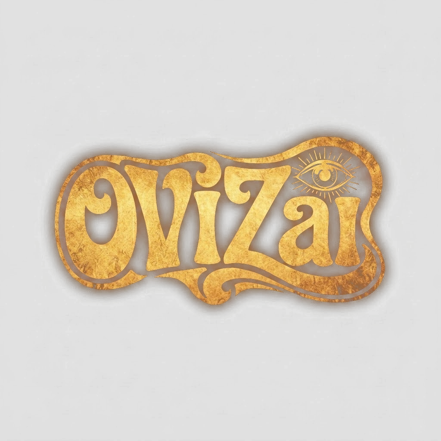

# 🎬 OVIZai — AI Art Direction & Cinematography Platform



> **Algorithmic Art Meets Narrative Cinema.**  
> OVIZai is a dark luxury Next.js 14 (App Router) web application crafted for high-end AI art direction, generative video production, and professional cinematography training.

---

## ⚡ Tech Stack

- **Framework:** [Next.js 14](https://nextjs.org/) (App Router, Server Components & Client Hooks)
- **Language:** [TypeScript](https://www.typescriptlang.org/) (Strict typing across components & API routes)
- **Styling:** [Tailwind CSS](https://tailwindcss.com/) (Custom Dark Luxury design system, glassmorphism, HSL color tokens)
- **Icons:** [Lucide React](https://lucide.dev/)
- **Database:** [Supabase](https://supabase.com/) (PostgreSQL client lead capture)
- **Transactional Mail:** [Resend API](https://resend.com/) (SLA 24/48h auto-responder & team notifications)
- **Currency Engine:** Live exchange rate API (`open.er-api.com`) with 24h Next.js cache (`revalidate = 86400`) and commercial luxury rounding.

---

## 📐 Multi-Page Architecture

```text
src/
├── app/
│   ├── layout.tsx            # Root Layout wrapped with CurrencyProvider
│   ├── page.tsx              # Minimalist Command Hub Homepage (/)
│   ├── services/             # 5 Core AI Production Pillars (/services)
│   ├── formation/            # AI Video Masterclass & Stack (/formation)
│   ├── contact/              # Qualified Brief & Quote Form (/contact)
│   └── api/
│       ├── leads/            # Supabase insert & Resend email dispatch
│       └── rates/            # 24h cached exchange rate API (/api/rates)
├── components/
│   ├── TopBar.tsx            # 100% Fixed Header & Right-Side Flyout Drawer
│   ├── HeroBrutalist.tsx     # Hero Section with radial mask dissolve logo
│   ├── CommandMenu.tsx       # 4-Option Bento Command Hub & ⌘K modal
│   ├── ServicesGrid.tsx      # Interactive Services accordion & currency rates
│   ├── MasterclassSection.tsx# 5-Module Masterclass curriculum & live tuition
│   ├── QualifiedContact.tsx  # Dynamic budget selection cards & lead form
│   ├── AIPipeline.tsx        # Generative AI pipeline steps (Visuals, Motion, 3D Camera, 4K Color Grading)
│   └── NewsletterForm.tsx    # Footer newsletter lead capture
├── context/
│   └── CurrencyContext.tsx   # USD / EUR / CAD currency state & rounding logic
├── lib/
│   ├── i18n.ts               # FR / EN dictionary
│   ├── mail.ts               # Resend transactional email helper
│   └── supabaseServer.ts     # Supabase admin server client
└── types/
    └── index.ts              # TypeScript interface definitions
```

---

## 💱 Live Multi-Currency Engine

OVIZai features an automated live multi-currency converter powered by Next.js revalidation:

1. **Base Currency:** USD ($)
2. **Supported Currencies:** USD ($), EUR (€), CAD ($)
3. **Cache Policy:** 24-hour server revalidation (`revalidate: 86400`) via `/api/rates`.
4. **Luxury Commercial Rounding:**
   - **Amounts < $1,000:** Rounded to nearest 10 (e.g. `490 $ USD`, `450 €`, `650 $ CAD`).
   - **Amounts ≥ $1,000:** Rounded to nearest 50/100 (e.g. `1 350 $`, `7 400 €`).

---

## 🎨 Design System

- **Backgrounds:** Deep Obsidian `#080808` & Dark Bronze `#0B0A08`.
- **Text:** Cream White `#ECE4D3` & Muted Bronze `#8C8375`.
- **Accents & Gold Glow:** Antique Gold `#CAA243` & Bright Gold `#F0C869`.
- **Borders & Cards:** `border border-white/[0.08]` with `backdrop-blur-md` and gold hover accents.

---

## ⚙️ Environment Variables

Create a `.env.local` file in the root directory:

```bash
# Supabase Configuration
NEXT_PUBLIC_SUPABASE_URL=https://your-supabase-project.supabase.co
NEXT_PUBLIC_SUPABASE_ANON_KEY=your-supabase-anon-key
SUPABASE_SERVICE_ROLE_KEY=your-supabase-service-role-key

# Transactional Mail (Resend)
RESEND_API_KEY=re_your_resend_api_key
```

---

## 🚀 Local Development

```bash
# 1. Install dependencies
npm install

# 2. Start Next.js development server
npm run dev

# 3. Open browser at http://localhost:3000
```

---

## 🔒 Security & Quality Assurance

- **Zero Dead Links:** All buttons, drawers, modals, and route transitions utilize native Next.js `<Link>` components or typed state handlers.
- **Form Validation:** Client-side regex email checking with server-side PostgreSQL unique constraint handling (23505).
- **SEO & Social Meta:** Full OpenGraph and Twitter card metadata configured in `layout.tsx`.

---

© 2026 OVIZai. Direction Artistique & Cinéma IA. Tous droits réservés.